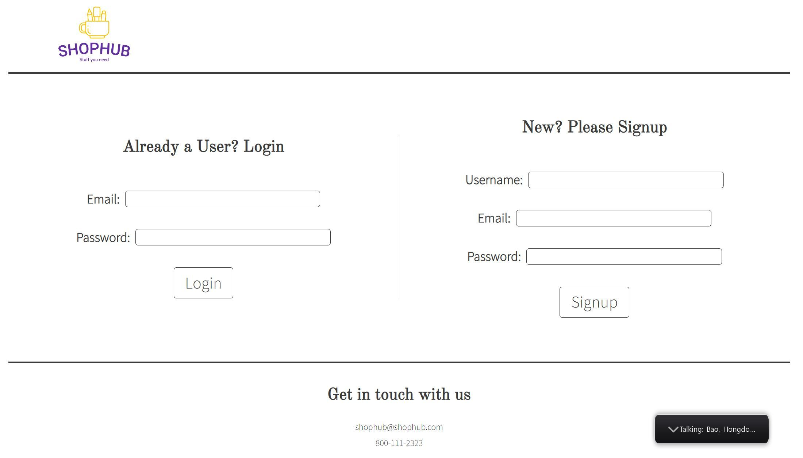
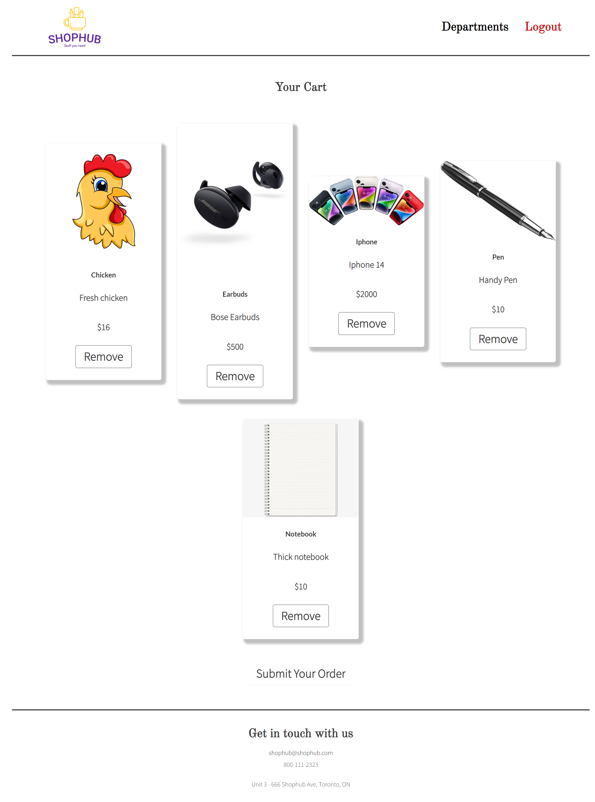

# ShopHub

- [Description](#description)
- [Deployment](#deployment)
- [Visualization](#visualization)
- [Contributors and Github Profile Links](#contributors-and-github-profile-links)
- [Technologies Used](#technologies-used)
- [Contribution](#contribution)
- [License](#license)

## Description

Creating a website that houses various types of products that are “in-demand” and allowing a central place to purchase these items such as groceries, electronics, and housing decor. This will all be accessed with the help of an account that needs to be made and then putting stuff into a cart which will save the items (usage of cookies), as well as multiple pages that will redirect us to products aka department names that will then push us to specific tables of products afterwards. Then allows us to checkout at the end of our browsing session.

## Deployment

[Proposal](https://docs.google.com/document/d/1kmyQD6_7Fla_8bfDKzs8xkVmhGcS4hd96DWq0I5PRho/edit)

[Wireframe](https://docs.google.com/presentation/d/1HLqLTQ9TJbIWPU1O5Kn7DyuAWZnS1WVaWk58EMMwJDE/edit?usp=sharing)

[Deployed Application](https://frightful-coffin-45274.herokuapp.com/)

[Github Repository](https://github.com/thivsiv28/Team9)

[Presentation Slideshow](https://docs.google.com/presentation/d/1T1B6nbWw1Zp_jIxI2oURdWSJqD0Td_qnuf2DyaHqp-0/edit#slide=id.gc6f980f91_0_0)

## Visualization

-This is the Signup/Login Page

-This is the Departments Page

-This is the Products Page

-This is the Cart Page

## Contributors and Github Profile Links

[Hondong Bao](https://github.com/BranBao1995)

[Muaiz Khan](https://github.com/Muaizkh)

[Thiviya Sivasithamparam](https://github.com/thivsiv28)

## Technologies Used:

- [HTML](https://developer.mozilla.org/en-US/docs/Web/HTML)
- [CSS](https://www.w3schools.com/css/)
- [Javascript](https://www.javascript.com/)
- [Node.js](https://nodejs.org/en/)
- [Sequelize](https://sequelize.org/)
- [MySQL](https://www.mysql.com/)
- [Semantic UI](https://semantic-ui.com/)
- [Handlebars.js](https://handlebarsjs.com/)
- [Bcrypt](https://www.npmjs.com/package/bcryptjs)
- [Express](https://expressjs.com/)

## License

MIT License 

Copyright (c) 2022 thivsiv28

Permission is hereby granted, free of charge, to any person obtaining a copy
of this software and associated documentation files (the "Software"), to deal
in the Software without restriction, including without limitation the rights
to use, copy, modify, merge, publish, distribute, sublicense, and/or sell
copies of the Software, and to permit persons to whom the Software is
furnished to do so, subject to the following conditions:

The above copyright notice and this permission notice shall be included in all
copies or substantial portions of the Software.

THE SOFTWARE IS PROVIDED "AS IS", WITHOUT WARRANTY OF ANY KIND, EXPRESS OR
IMPLIED, INCLUDING BUT NOT LIMITED TO THE WARRANTIES OF MERCHANTABILITY,
FITNESS FOR A PARTICULAR PURPOSE AND NONINFRINGEMENT. IN NO EVENT SHALL THE
AUTHORS OR COPYRIGHT HOLDERS BE LIABLE FOR ANY CLAIM, DAMAGES OR OTHER
LIABILITY, WHETHER IN AN ACTION OF CONTRACT, TORT OR OTHERWISE, ARISING FROM,
OUT OF OR IN CONNECTION WITH THE SOFTWARE OR THE USE OR OTHER DEALINGS IN THE
SOFTWARE.
